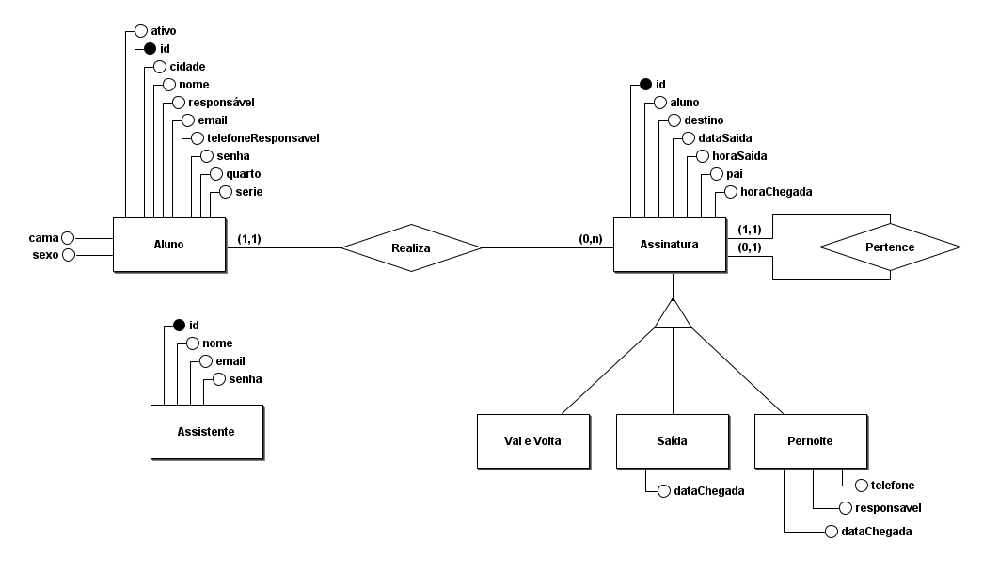
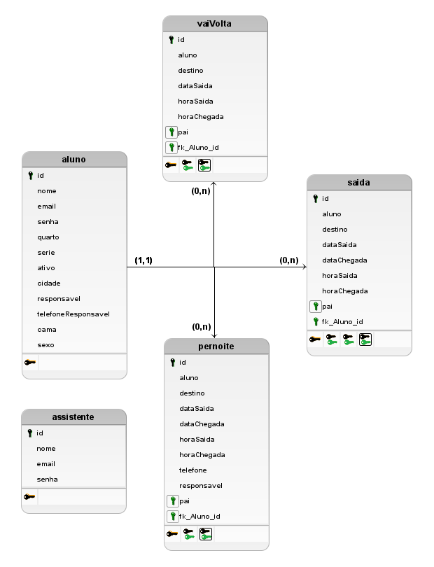

# Trabalho Final #04
Backend (Fictício) do projeto CGAE - Listas Eletrônicas

## Integrantes
- Bernardo Rafael Sales Saraiva
- Henrique Cardoso de Souza
- Jackson Darley Rocha Santos
- João Marcos Martins Xavier
- Ígor Gabriel Sena Matos

## Modelo Conceitual do Banco de Dados


## Modelo Lógico do Banco de Dados


## Modelo Físico do Banco de Dados
[Arquivo SQL do Banco de Dados](./db/DDL.sql)

### Ferramentas Utilizadas 🚀
- **brModelo** -> Design
- [**Neon Tech**](https://neon.tech) -> Hospedagem

## Descrição do projeto
CGAE - Listas Eletrônicas é um projeto com o intuito de digitalizar os sistemas de controle de saída dos alunos residentes do campus.

## Endpoints da API

### URL DA API: https://tf-04.vercel.app

### [POST] /login
- **Descrição:** Realiza o login apartir das credenciais de algum aluno ou assistente cadastrados.
- **body:**

```json
    "email": "email",
    "senha": "senha"
```

- **Usuários default:**
    - **Aluno**
        ```json
        "email": "aluno@email",
        "senha": "aluno123"
        ```
    - **Assistente**
        ```json
        "email": "admin@email",
        "senha": "admin123"
        ```

---
### [GET] /aluno
- **Descrição:** Traz os dados de todos os alunos cadastrados no banco de dados.
- **headers:**

```js
x-access-token: "token"
```

---
### [GET] /aluno/{id}
- **Descrição:** Traz os dados de um aluno em específico.
- **headers:**

```js
x-access-token: "token"
```

---
### [POST] /aluno
- **Descrição:** Insere um novo aluno no banco de dados.
- **headers:**

```js
x-access-token: "token"
```

- **body:**

```json

```

---
### [PATCH] /aluno
- **Descrição:** Atualiza os dados de um aluno cadastrado.
- **headers:**

```js
x-access-token: "token"
```

- **body:**

```json

```

---
### [DELETE] /aluno
- **Descrição:** Exclui um aluno cadastrado.
- **headers:**

```js
x-access-token: "token"
```

---
### [GET] /assinatura/{lista}
- **Descrição:** Traz os dados de todas as assinaturas de uma lista.
- **headers:**

```js
x-access-token: "token"
```

- **Observações:**
Possíveis valores para o parâmetro lista

```js
vai_volta
saida
pernoite
```

---
### [GET] /assinatura/{lista}/{id}
- **Descrição:** Traz os dados de uma assinatura em específico.
- **headers:**

```js
x-access-token: "token"
```

- **Observações:**
Possíveis valores para o parâmetro lista

```js
vai_volta
saida
pernoite
```

---
### [POST] /assinatura/{lista}
- **Descrição:** Insere uma nova assinatura no banco de dados.
- **headers:**

```js
x-access-token: "token"
```

- **Observações:**
Possíveis valores para o parâmetro lista

```js
vai_volta
saida
pernoite
```

- **body:**

```json

```

### [PATCH] /assinatura/{lista}/{id}
- **Descrição:** Atualiza os dados de uma assinatura cadastrada.
- **headers:**

```js
x-access-token: "token"
```

- **body:**

```json

```

- **Observações:**
Possíveis valores para o parâmetro lista

```js
vai_volta
saida
pernoite
```

---
### [DELETE] /assinatura/{lista}/{id}
- **Descrição:** Exclui uma assinatura cadastrada.
- **headers:**

```js
x-access-token: "token"
```

- **Observações:**
Possíveis valores para o parâmetro lista

```js
vai_volta
saida
pernoite
```