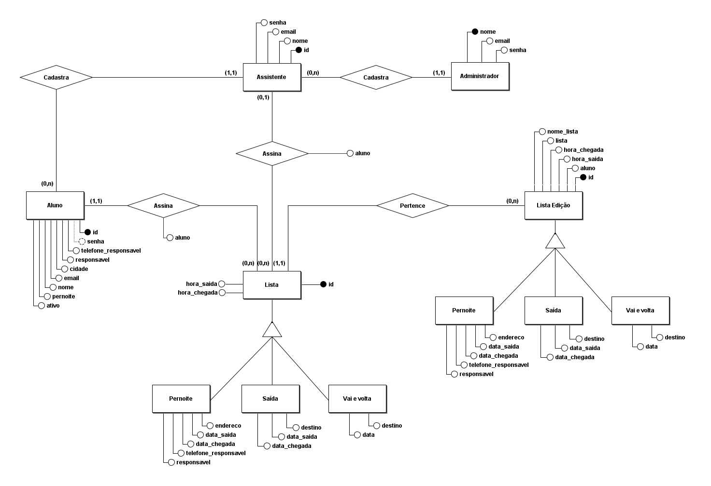
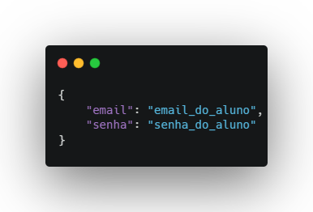
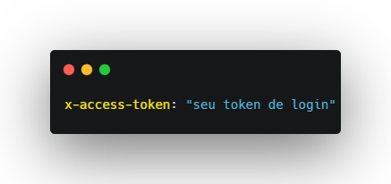
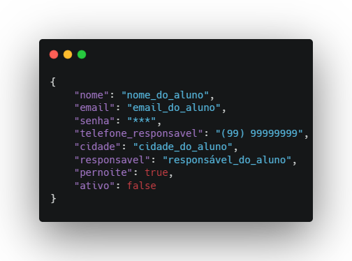
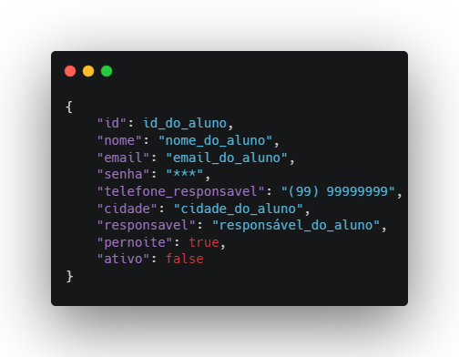
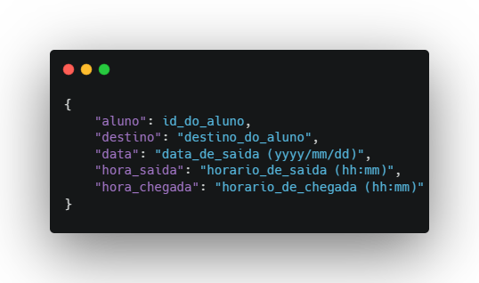
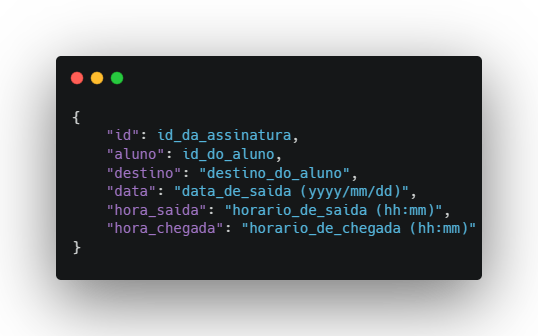

# Trabalho Final #04
Backend (Fictício) do projeto CGAE - Listas Eletrônicas

## Integrantes
- Bernardo Rafael Sales Saraiva
- Henrique Cardoso de Souza
- Jackson Darley Rocha Santos
- João Marcos Martins Xavier
- Ígor Gabriel Sena Matos

## Modelo Conceitual do Banco de Dados

## Descrição do projeto
CGAE - Listas Eletrônicas é um projeto com o intuito de digitalizar os sistemas de controle de saída dos alunos residentes do campus.

## Endpoints da API

### Raiz
- **Descrição:** Traz informações relacionadas ao repositório do projeto.
- **Endpoint:** https://tf-04.vercel.app/
- **Tipo da requisição:** GET

### Login
- **Descrição:** Realiza o login apartir das credenciais de algum aluno cadastrado.
- **Endpoint:** https://tf-04.vercel.app/login
- **Tipo da requisição:** POST
- **body:**

- **Usuário default:**
    - **Email:** hcs@gmail.com
    - **Senha:** 123

### Consultar Alunos
- **Descrição:** Traz os dados de todos os alunos cadastrados no banco de dados.
- **Endpoint:** https://tf-04.vercel.app/aluno
- **Tipo da requisição:** GET
- **headers:**

### Consultar Aluno
- **Descrição:** Traz os dados de um aluno em específico.
- **Endpoint:** https://tf-04.vercel.app/aluno/:id
- **Tipo da requisição:** GET
- **headers:**

### Cadastrar Aluno
- **Descrição:** Insere um novo aluno no banco de dados.
- **Endpoint:** https://tf-04.vercel.app/aluno
- **Tipo da requisição:** POST
- **headers:**

- **body:**

### Atualizar Aluno
- **Descrição:** Atualiza os dados de um aluno cadastrado.
- **Endpoint:** https://tf-04.vercel.app/aluno
- **Tipo da requisição:** PATCH
- **headers:**

- **body:**

### Excluir Aluno
- **Descrição:** Exclui um aluno cadastrado.
- **Endpoint:** https://tf-04.vercel.app/aluno/:id
- **Tipo da requisição:** DELETE
- **headers:**

### Consultar Assinaturas
- **Descrição:** Traz os dados de todas as assinaturas cadastradas no banco de dados.
- **Endpoint:** https://tf-04.vercel.app/assinaturas
- **Tipo da requisição:** GET
- **headers:**

### Consultar Assinatura
- **Descrição:** Traz os dados de uma assinatura em específico.
- **Endpoint:** https://tf-04.vercel.app/assinatura/:id
- **Tipo da requisição:** GET
- **headers:**

### Cadastrar Assinatura
- **Descrição:** Insere uma nova assinatura no banco de dados.
- **Endpoint:** https://tf-04.vercel.app/assinatura
- **Tipo da requisição:** POST
- **headers:**

- **body:**

### Atualizar Assinatura
- **Descrição:** Atualiza os dados de uma assinatura cadastrada.
- **Endpoint:** https://tf-04.vercel.app/assinatura
- **Tipo da requisição:** PATCH
- **headers:**

- **body:**

### Excluir Assinatura
- **Descrição:** Exclui uma assinatura cadastrada.
- **Endpoint:** https://tf-04.vercel.app/assinatura/:id
- **Tipo da requisição:** DELETE
- **headers:**

